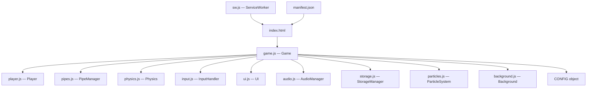
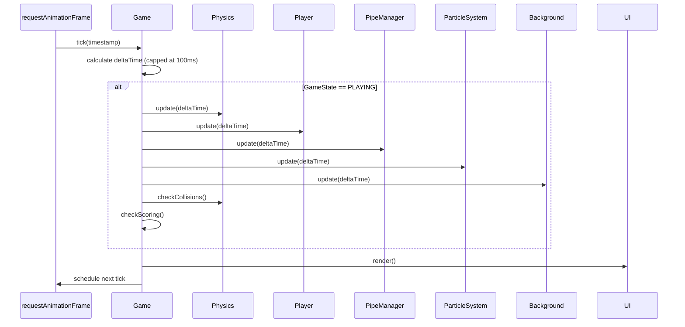
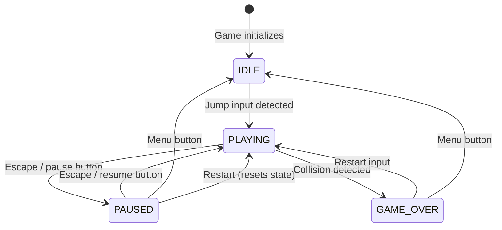

# Design Document: Flappy Bird Game

## Overview

This document describes the technical design for a complete Flappy Bird clone built exclusively with HTML5, CSS3, and vanilla JavaScript ES6+. The game uses the Canvas API for rendering, the Web Audio API for procedural sound generation, and localStorage for persistence. The architecture follows a modular, class-based approach with clear separation of concerns, dependency injection, and a central game loop driven by `requestAnimationFrame`.

The project runs entirely offline by opening `index.html` directly in a browser, with optional PWA/Service Worker support for installability. All visual assets are drawn programmatically on the Canvas — no external image files are required.

---

## Architecture

The system is organized around a central `Game` class that owns the game loop and coordinates all subsystems. Each subsystem is a self-contained ES6 class with a single responsibility. Communication between modules happens through direct method calls (dependency injection) rather than global state.



### Game Loop Flow



### State Machine



---

## Components and Interfaces

### `Game` (game.js)

The root orchestrator. Owns the game loop, holds references to all subsystems, and manages `GameState` transitions.

```js
class Game {
  constructor(canvas)
  init()                        // instantiate subsystems, register input callbacks
  start()                       // begin requestAnimationFrame loop
  tick(timestamp)               // main loop: deltaTime → update → render
  update(deltaTime)             // delegates to subsystems when PLAYING
  render()                      // delegates to UI
  changeState(newState)         // transitions GameState, triggers side effects
  restart()                     // resets Player, PipeManager, Score, Particles
  destroy()                     // cancels RAF, removes listeners, closes AudioContext
}
```

**CONFIG object** (exported from game.js):

```js
export const CONFIG = {
  GRAVITY: 1500,            // px/s²
  JUMP_VELOCITY: -450,      // px/s
  PIPE_SPEED_EASY: 180,     // px/s
  PIPE_SPEED_NORMAL: 220,   // px/s
  PIPE_SPEED_HARD: 280,     // px/s
  PIPE_INTERVAL_EASY: 2.0,  // seconds
  PIPE_INTERVAL_NORMAL: 1.8,
  PIPE_INTERVAL_HARD: 1.5,
  GAP_EASY: 180,            // px
  GAP_NORMAL: 150,
  GAP_HARD: 120,
  PIPE_SPEED_INCREMENT: 5,  // px/s per 10 points
  PIPE_SPEED_MAX: 400,      // px/s
  DELTA_TIME_CAP: 0.1,      // seconds
  PLAYER_X_RATIO: 0.25,     // fraction of canvas width
  COLLISION_SHRINK: 0.70,   // hitbox size relative to sprite
  SPRITE_FPS: 10,           // bird wing animation frames per second
  SPRITE_FRAMES: 3,
  INPUT_DEBOUNCE_MS: 100,
  ASPECT_MOBILE: [9, 16],
  ASPECT_DESKTOP: [4, 3],
};
```

---

### `Player` (player.js)

Manages the bird's position, velocity, rotation, and sprite animation.

```js
class Player {
  constructor(canvas, config)
  reset()                       // restore initial position and velocity
  update(deltaTime)             // advance animation frame
  applyGravity(deltaTime)       // called by Physics
  jump()                        // set vertical velocity to JUMP_VELOCITY
  getBounds()                   // returns { x, y, w, h } hitbox (shrunk)
  render(ctx)                   // draw animated sprite on canvas
}
```

**Sprite drawing**: The bird is drawn programmatically using `ctx.arc`, `ctx.bezierCurveTo`, and `ctx.fillStyle`. Three frames cycle the wing position (up, mid, down). Rotation is applied via `ctx.save/restore` and `ctx.rotate`.

---

### `PipeManager` (pipes.js)

Generates, moves, and removes pipe obstacles.

```js
class PipeManager {
  constructor(canvas, config)
  reset()                       // clear all active pipes, reset timer
  update(deltaTime)             // move pipes, spawn new ones, remove off-screen
  getPipes()                    // returns array of active Pipe objects
  render(ctx)                   // draw all pipes
  incrementDifficulty(score)    // adjust speed based on score
}

// Internal Pipe data structure:
// { x, gapTop, gapBottom, width, passed: boolean }
```

---

### `Physics` (physics.js)

Applies gravity to the Player and performs collision detection.

```js
class Physics {
  constructor(canvas, config)
  update(player, deltaTime)     // apply gravity, clamp to top boundary
  checkCollisions(player, pipes, canvasHeight)
    // returns { hit: boolean, type: 'pipe' | 'floor' | null }
}
```

Collision uses AABB (Axis-Aligned Bounding Box) intersection between the player's shrunk hitbox and each pipe segment's rectangle.

---

### `InputHandler` (input.js)

Captures and normalizes keyboard, mouse, and touch events.

```js
class InputHandler {
  constructor(canvas, config)
  onJump(callback)              // register jump callback
  onPause(callback)             // register pause/resume callback
  destroy()                     // remove all event listeners
}
```

Internally debounces jump events by `INPUT_DEBOUNCE_MS`. Prevents default on Space, ArrowUp, and touchstart. Detects swipe-up gestures by comparing `touchstart` and `touchend` Y coordinates.

---

### `UI` (ui.js)

Renders all game screens and HUD elements on the canvas.

```js
class UI {
  constructor(canvas, config)
  render(gameState, score, highScore, darkMode)
  renderHUD(score)              // score display during PLAYING
  renderIdle(highScore, difficulty, darkMode, isTouchDevice)
  renderPaused()
  renderGameOver(score, highScore)
  renderSettings(volume, difficulty, darkMode, highScore)
  setScale(scaleX, scaleY)      // called on canvas resize
}
```

All text and button positions are computed relative to canvas dimensions so they scale correctly on resize.

---

### `AudioManager` (audio.js)

Generates and plays procedural sounds using the Web Audio API.

```js
class AudioManager {
  constructor()
  init()                        // create AudioContext on first user interaction
  playJump()                    // 400→600 Hz, 100ms
  playPoint()                   // 880 Hz, 150ms
  playCollision()               // 300→100 Hz, 300ms
  playGameOver()                // low rumble, 500ms
  setVolume(level)              // 0.0–1.0, updates GainNode
  destroy()                     // close AudioContext
}
```

Each sound is synthesized with an `OscillatorNode` + `GainNode` chain. The `AudioContext` is created lazily on the first user gesture to comply with browser autoplay policies. If the Web Audio API is unavailable, all methods are no-ops.

---

### `StorageManager` (storage.js)

Wraps localStorage with JSON serialization and fallback to in-memory storage.

```js
class StorageManager {
  constructor()
  getHighScore()                // returns number, default 0
  setHighScore(score)
  getDifficulty()               // returns 'EASY'|'NORMAL'|'HARD', default 'NORMAL'
  setDifficulty(difficulty)
  getDarkMode()                 // returns boolean, default false
  setDarkMode(enabled)
  getVolume()                   // returns number 0.0–1.0, default 0.8
  setVolume(level)
  resetHighScore()
}
```

Keys: `flappybird_highscore`, `flappybird_difficulty`, `flappybird_darkmode`, `flappybird_volume`.

---

### `ParticleSystem` (particles.js)

Manages short-lived visual particle effects.

```js
class ParticleSystem {
  constructor()
  emitCollision(x, y)           // burst of red/orange particles
  emitPoint(x, y)               // burst of yellow/white particles
  update(deltaTime)             // advance particle positions and lifetimes
  render(ctx)                   // draw all active particles
  reset()                       // clear all particles
}
```

Each particle has: `{ x, y, vx, vy, life, maxLife, color, size }`. Particles fade out as `life → 0`.

---

### `Background` (background.js)

Renders a multi-layer parallax background.

```js
class Background {
  constructor(canvas, config)
  update(pipeSpeed, deltaTime)  // scroll each layer proportionally
  render(ctx, darkMode)         // draw sky, far clouds, near clouds, ground
  reset()                       // reset scroll offsets
}
```

Three layers:
- **Sky** (static gradient): drawn once per frame
- **Far clouds** (20% of pipe speed): slow-moving distant clouds
- **Near clouds** (50% of pipe speed): faster mid-ground clouds
- **Ground** (80% of pipe speed): scrolling ground strip

---

## Data Models

### GameState Enum

```js
const GameState = Object.freeze({
  IDLE: 'IDLE',
  PLAYING: 'PLAYING',
  PAUSED: 'PAUSED',
  GAME_OVER: 'GAME_OVER',
});
```

### Pipe Object

```js
{
  x: number,          // left edge position in canvas px
  gapTop: number,     // Y coordinate of gap top edge
  gapBottom: number,  // Y coordinate of gap bottom edge
  width: number,      // pipe width in px (constant, e.g. 60px)
  passed: boolean,    // true once player has crossed this pipe's center
}
```

### Particle Object

```js
{
  x: number,
  y: number,
  vx: number,         // horizontal velocity px/s
  vy: number,         // vertical velocity px/s
  life: number,       // remaining lifetime in seconds
  maxLife: number,    // initial lifetime for alpha calculation
  color: string,      // CSS color string
  size: number,       // radius in px
}
```

### StorageData Schema

```js
{
  flappybird_highscore: number,          // integer ≥ 0
  flappybird_difficulty: 'EASY'|'NORMAL'|'HARD',
  flappybird_darkmode: boolean,
  flappybird_volume: number,             // 0.0–1.0
}
```

### Difficulty Config

```js
{
  speed: number,      // initial pipe speed px/s
  interval: number,   // pipe spawn interval in seconds
  gap: number,        // gap size in px
}
```

---

## Correctness Properties

*A property is a characteristic or behavior that should hold true across all valid executions of a system — essentially, a formal statement about what the system should do. Properties serve as the bridge between human-readable specifications and machine-verifiable correctness guarantees.*

### Property 1: Delta Time Cap

*For any* sequence of frame timestamps, the delta time passed to the physics update SHALL never exceed 100ms (0.1 seconds), regardless of how large the gap between frames is.

**Validates: Requirements 1.6**

---

### Property 2: Gravity Integration Monotonicity

*For any* player with zero initial vertical velocity, after applying gravity for any positive delta time, the player's vertical velocity SHALL be greater than zero (falling downward).

**Validates: Requirements 2.2**

---

### Property 3: Jump Velocity Override

*For any* player state (regardless of current vertical velocity), after a jump event is applied, the player's vertical velocity SHALL equal exactly `JUMP_VELOCITY` (negative, upward).

**Validates: Requirements 2.3**

---

### Property 4: Pipe Gap Boundary Invariant

*For any* generated pipe, the gap top edge SHALL be at least 80px from the canvas top, and the gap bottom edge SHALL be at least 80px from the canvas bottom.

**Validates: Requirements 3.3**

---

### Property 5: Pipe Gap Size by Difficulty

*For any* difficulty setting, every generated pipe's gap size (gapBottom − gapTop) SHALL equal exactly the configured gap for that difficulty (180px EASY, 150px NORMAL, 120px HARD).

**Validates: Requirements 3.4**

---

### Property 6: Pipe Speed Progression

*For any* score value S, the pipe speed SHALL equal `initialSpeed + floor(S / 10) * 5`, capped at `PIPE_SPEED_MAX` (400 px/s).

**Validates: Requirements 3.7, 6.4**

---

### Property 7: Collision Hitbox Shrink

*For any* player sprite bounding box, the collision hitbox width and height SHALL each equal 70% of the sprite's visual dimensions.

**Validates: Requirements 4.2**

---

### Property 8: Score Increment on Pipe Pass

*For any* pipe that the player crosses (player's X passes the pipe's center X), the score SHALL increase by exactly 1, and the pipe SHALL be marked as `passed = true` so it is never counted again.

**Validates: Requirements 5.2**

---

### Property 9: High Score Persistence Round Trip

*For any* score value written to StorageManager, reading it back SHALL return the same value (or the previous high score if the new score is lower).

**Validates: Requirements 5.5, 10.1**

---

### Property 10: StorageManager Default Values

*For any* key that has never been written (or whose stored value is invalid/missing), StorageManager SHALL return the correct default value without throwing an error.

**Validates: Requirements 10.5**

---

### Property 11: Input Debounce

*For any* sequence of jump events, no two jump callbacks SHALL be fired within less than `INPUT_DEBOUNCE_MS` (100ms) of each other.

**Validates: Requirements 8.8**

---

### Property 12: Parallax Layer Speed Ratios

*For any* pipe speed value, the background layer scroll speeds SHALL be: far layer = 20% of pipe speed, mid layer = 50% of pipe speed, near layer = 80% of pipe speed.

**Validates: Requirements 11.3**

---

### Property 13: Particle Lifetime Decay

*For any* particle, its `life` value SHALL strictly decrease each frame by `deltaTime`, and the particle SHALL be removed from the active list when `life ≤ 0`.

**Validates: Requirements 11.5, 11.6**

---

### Property 14: Volume Clamp

*For any* value passed to `AudioManager.setVolume()`, the resulting gain SHALL be clamped to the range [0.0, 1.0].

**Validates: Requirements 9.6**

---

## Error Handling

| Scenario | Module | Strategy |
|---|---|---|
| `localStorage` unavailable or throws | StorageManager | Catch exception, fall back to in-memory Map, continue silently |
| `AudioContext` not supported | AudioManager | Check `window.AudioContext`, use no-op methods if absent |
| `AudioContext` suspended (autoplay policy) | AudioManager | Call `ctx.resume()` on first user gesture |
| Canvas not found in DOM | Game | Throw descriptive error during `init()` |
| `requestAnimationFrame` not available | Game | Fall back to `setTimeout(tick, 16)` |
| ServiceWorker registration fails | sw.js | Log warning, game continues without PWA features |
| Invalid stored value (NaN, wrong type) | StorageManager | Return default value, overwrite with valid default |
| DeltaTime spike (tab hidden, slow device) | Game | Cap deltaTime at `DELTA_TIME_CAP` (0.1s) |

---

## Testing Strategy

### Dual Testing Approach

The testing strategy combines **unit/example-based tests** for specific behaviors and **property-based tests** for universal correctness guarantees.

**Unit tests** cover:
- Specific game state transitions (IDLE → PLAYING, PLAYING → GAME_OVER, etc.)
- Exact sound frequencies and durations
- Correct default values from StorageManager
- Canvas resize behavior
- Specific pipe generation edge cases

**Property-based tests** cover:
- Physics calculations across arbitrary delta times and velocities
- Pipe generation invariants across arbitrary canvas sizes and difficulty settings
- Score progression across arbitrary score values
- Storage round-trips across arbitrary valid data
- Input debounce across arbitrary event timing sequences
- Particle lifecycle across arbitrary emission counts and delta times

### Property-Based Testing Library

Use **[fast-check](https://github.com/dubzzz/fast-check)** (loaded as a local copy in `/js/vendor/fast-check.js` to maintain offline compatibility).

Each property test runs a minimum of **100 iterations**.

Tag format for each test:
```
// Feature: flappy-bird-game, Property N: <property_text>
```

### Test File Structure

```
/tests
├── physics.test.js       — Properties 1, 2, 3, 7
├── pipes.test.js         — Properties 4, 5, 6, 8
├── storage.test.js       — Properties 9, 10
├── input.test.js         — Property 11
├── background.test.js    — Property 12
├── particles.test.js     — Property 13
├── audio.test.js         — Property 14
└── game.test.js          — State machine transitions (example-based)
```

### Test Runner

Use **[Vitest](https://vitest.dev/)** (or Jest) for running tests in a Node.js environment. Canvas API calls are mocked using a lightweight canvas mock.

### Coverage Goals

- All 14 correctness properties covered by property-based tests
- All GameState transitions covered by example-based tests
- All StorageManager keys covered by round-trip tests
- All error handling paths covered by unit tests with mocked failures
