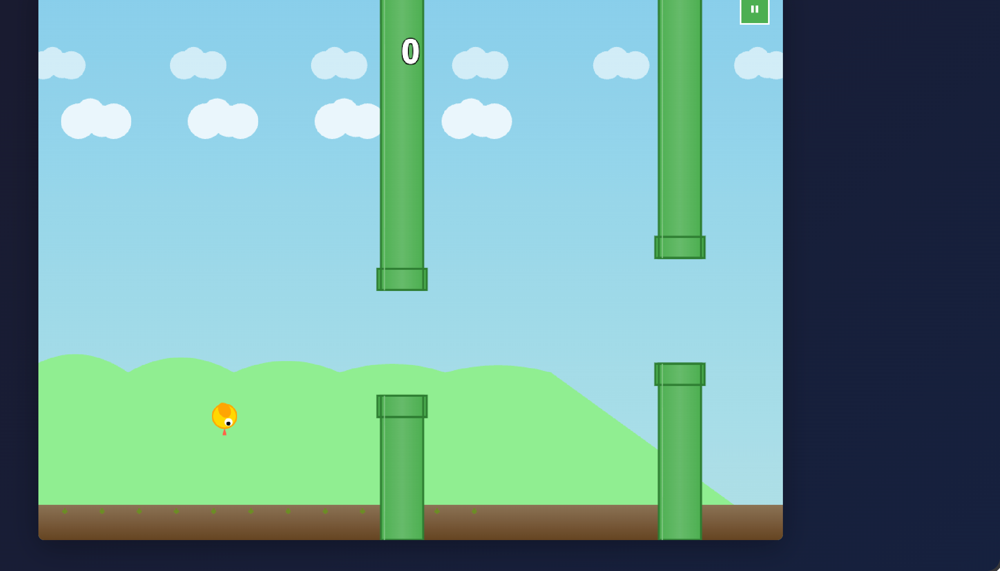
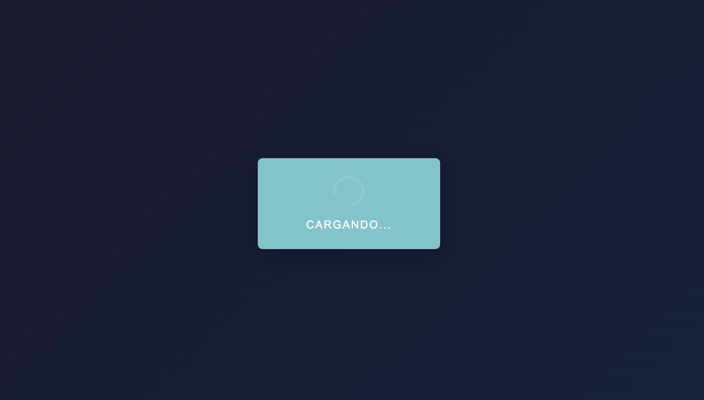
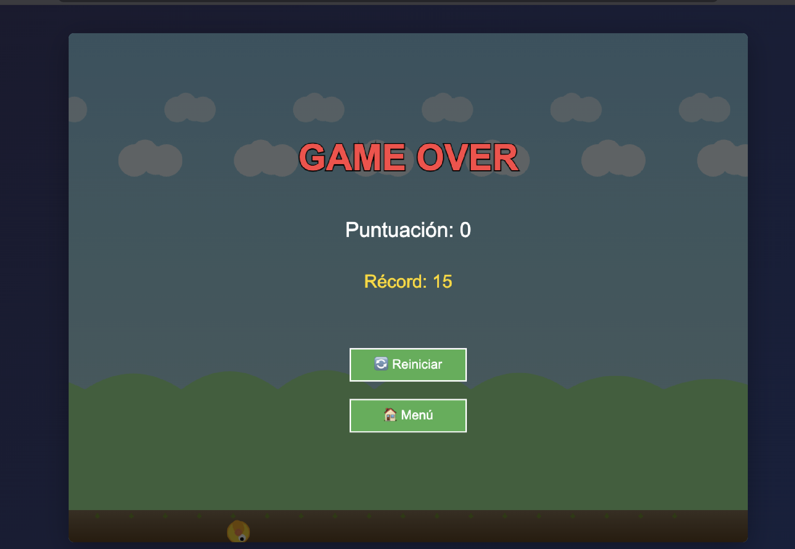

# 🐦 Flappy Bird

<div align="center">



**Un clon completo del clásico juego Flappy Bird**

Implementado con HTML5, CSS3 y JavaScript ES6+ vanilla (sin frameworks ni librerías externas)

[](https://opensource.org/licenses/MIT)
[](https://www.ecma-international.org/ecma-262/)
[](https://web.dev/progressive-web-apps/)

[🎮 Demo en Vivo](#) | [📖 Documentación](#-estructura-del-proyecto) | [🚀 Instalación](#-cómo-jugar)

</div>

---

## 📸 Capturas de Pantalla

<div align="center">

<table>
<tr>
<td width="33%">

<p align="center"><strong>Pantalla de Carga</strong></p>
</td>
<td width="33%">

<p align="center"><strong>Gameplay</strong></p>
</td>
<td width="33%">

<p align="center"><strong>Game Over</strong></p>
</td>
</tr>
</table>

</div>

---

## ✨ Características Destacadas

<table>
<tr>
<td width="50%">

### 🎮 Gameplay Completo
- ✅ Mecánica clásica de Flappy Bird
- ✅ Física realista con gravedad
- ✅ Generación procedural de obstáculos
- ✅ Detección de colisiones precisa (AABB)
- ✅ Sistema de puntuación
- ✅ Dificultad progresiva

</td>
<td width="50%">

### 🎨 Efectos Visuales
- ✅ Animación del pájaro (3 frames)
- ✅ Sistema de partículas
- ✅ Fondo parallax multicapa
- ✅ Modo oscuro completo
- ✅ Rotación dinámica del sprite
- ✅ Transiciones suaves

</td>
</tr>
<tr>
<td width="50%">

### 🔊 Audio Procedural
- ✅ Sonidos generados con Web Audio API
- ✅ Sin archivos externos
- ✅ Control de volumen
- ✅ 4 efectos de sonido únicos

</td>
<td width="50%">

### 📱 Multi-plataforma
- ✅ Responsive (móvil y desktop)
- ✅ Controles táctiles avanzados
- ✅ PWA instalable
- ✅ Funciona 100% offline
- ✅ Exportable a APK

</td>
</tr>
</table>

---

## 🎮 Características

- **100% Offline**: Funciona completamente sin conexión a internet
- **PWA**: Instalable como aplicación web progresiva
- **Responsive**: Se adapta a cualquier tamaño de pantalla
- **Multi-plataforma**: Compatible con desktop y dispositivos móviles
- **Controles múltiples**: Teclado, ratón y pantalla táctil
- **Audio procedural**: Sonidos generados con Web Audio API
- **Persistencia**: Guarda tu récord automáticamente
- **Modo oscuro**: Juega cómodamente en entornos con poca luz
- **Dificultad ajustable**: Elige entre EASY, NORMAL y HARD
- **Sistema de pausa**: Pausa el juego en cualquier momento
- **Efectos visuales**: Partículas y fondo parallax animado

---

## 🚀 Cómo Jugar

### Opción 1: Servidor Local (Recomendado)

Los módulos ES6 requieren un servidor HTTP. Usa cualquiera de estos métodos:

```bash
# Con Python 3
cd flappy-bird
python3 -m http.server 8080

# Con Node.js (http-server)
npx http-server -p 8080

# Con PHP
php -S localhost:8080
```

Luego abre **http://localhost:8080** en tu navegador.

### Opción 2: Extensión Live Server (VS Code)

1. Instala la extensión "Live Server" en VS Code
2. Click derecho en `index.html` → "Open with Live Server"

---

## 🎯 Controles

<table>
<tr>
<th>Plataforma</th>
<th>Acción</th>
<th>Control</th>
</tr>
<tr>
<td rowspan="3"><strong>🖥️ Desktop</strong></td>
<td>Saltar</td>
<td><kbd>Espacio</kbd> o <kbd>↑</kbd> o <kbd>Click</kbd></td>
</tr>
<tr>
<td>Pausar</td>
<td><kbd>Esc</kbd></td>
</tr>
<tr>
<td>Interactuar</td>
<td><kbd>Click</kbd> en botones</td>
</tr>
<tr>
<td rowspan="2"><strong>📱 Móvil</strong></td>
<td>Saltar</td>
<td><strong>Tap</strong> o <strong>Swipe ↑</strong></td>
</tr>
<tr>
<td>Interactuar</td>
<td><strong>Tap</strong> en botones</td>
</tr>
</table>
