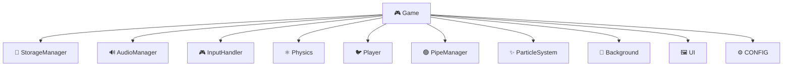

# 🐦 Flappy Bird

<div align="center">


**Un clon completo del clásico juego Flappy Bird**

Implementado con HTML5, CSS3 y JavaScript ES6+ vanilla (sin frameworks ni librerías externas)

[](https://opensource.org/licenses/MIT)
[](https://www.ecma-international.org/ecma-262/)
[](https://web.dev/progressive-web-apps/)

[🎮 Demo en Vivo](#) | [📖 Documentación](#-estructura-del-proyecto) | [🚀 Instalación](#-cómo-jugar)

</div>

---

## 📸 Capturas de Pantalla

<div align="center">

<table>
<tr>
<td width="33%">

<p align="center"><strong>Pantalla de Carga</strong></p>
</td>
<td width="33%">

<p align="center"><strong>Gameplay</strong></p>
</td>
<td width="33%">

<p align="center"><strong>Game Over</strong></p>
</td>
</tr>
</table>

</div>

---

## ✨ Características Destacadas

<table>
<tr>
<td width="50%">

### 🎮 Gameplay Completo
- ✅ Mecánica clásica de Flappy Bird
- ✅ Física realista con gravedad
- ✅ Generación procedural de obstáculos
- ✅ Detección de colisiones precisa (AABB)
- ✅ Sistema de puntuación
- ✅ Dificultad progresiva

</td>
<td width="50%">

### 🎨 Efectos Visuales
- ✅ Animación del pájaro (3 frames)
- ✅ Sistema de partículas
- ✅ Fondo parallax multicapa
- ✅ Modo oscuro completo
- ✅ Rotación dinámica del sprite
- ✅ Transiciones suaves

</td>
</tr>
<tr>
<td width="50%">

### 🔊 Audio Procedural
- ✅ Sonidos generados con Web Audio API
- ✅ Sin archivos externos
- ✅ Control de volumen
- ✅ 4 efectos de sonido únicos

</td>
<td width="50%">

### 📱 Multi-plataforma
- ✅ Responsive (móvil y desktop)
- ✅ Controles táctiles avanzados
- ✅ PWA instalable
- ✅ Funciona 100% offline
- ✅ Exportable a APK

</td>
</tr>
</table>

---

## 🎮 Características

- **100% Offline**: Funciona completamente sin conexión a internet
- **PWA**: Instalable como aplicación web progresiva
- **Responsive**: Se adapta a cualquier tamaño de pantalla
- **Multi-plataforma**: Compatible con desktop y dispositivos móviles
- **Controles múltiples**: Teclado, ratón y pantalla táctil
- **Audio procedural**: Sonidos generados con Web Audio API
- **Persistencia**: Guarda tu récord automáticamente
- **Modo oscuro**: Juega cómodamente en entornos con poca luz
- **Dificultad ajustable**: Elige entre EASY, NORMAL y HARD
- **Sistema de pausa**: Pausa el juego en cualquier momento
- **Efectos visuales**: Partículas y fondo parallax animado

---

## 🚀 Cómo Jugar

### Opción 1: Servidor Local (Recomendado)

Los módulos ES6 requieren un servidor HTTP. Usa cualquiera de estos métodos:

```bash
# Con Python 3
cd flappy-bird
python3 -m http.server 8080

# Con Node.js (http-server)
npx http-server -p 8080

# Con PHP
php -S localhost:8080
```

Luego abre **http://localhost:8080** en tu navegador.

### Opción 2: Extensión Live Server (VS Code)

1. Instala la extensión "Live Server" en VS Code
2. Click derecho en `index.html` → "Open with Live Server"

---

## 🎯 Controles

<table>
<tr>
<th>Plataforma</th>
<th>Acción</th>
<th>Control</th>
</tr>
<tr>
<td rowspan="3"><strong>🖥️ Desktop</strong></td>
<td>Saltar</td>
<td><kbd>Espacio</kbd> o <kbd>↑</kbd> o <kbd>Click</kbd></td>
</tr>
<tr>
<td>Pausar</td>
<td><kbd>Esc</kbd></td>
</tr>
<tr>
<td>Interactuar</td>
<td><kbd>Click</kbd> en botones</td>
</tr>
<tr>
<td rowspan="2"><strong>📱 Móvil</strong></td>
<td>Saltar</td>
<td><strong>Tap</strong> o <strong>Swipe ↑</strong></td>
</tr>
<tr>
<td>Interactuar</td>
<td><strong>Tap</strong> en botones</td>
</tr>
</table>

---

## 🚀 Cómo jugar

### Opción 1: Abrir directamente
1. Descarga o clona este repositorio
2. Abre el archivo `index.html` en tu navegador moderno
3. ¡Disfruta del juego!

### Opción 2: Servidor local (opcional)
```bash
# Con Python 3
python -m http.server 8000

# Con Node.js (http-server)
npx http-server -p 8000

# Luego abre http://localhost:8000 en tu navegador
```

## 🎯 Controles

### Desktop
- **Espacio** o **Flecha Arriba**: Saltar
- **Click izquierdo**: Saltar
- **Escape**: Pausar/Reanudar

### Móvil
- **Tap**: Saltar
- **Swipe hacia arriba**: Saltar
- **Botón de pausa**: Pausar/Reanudar

---

## 📁 Estructura del proyecto

```
flappy-bird/
├── 📄 index.html              # Página principal
├── 📄 manifest.json           # Manifiesto PWA
├── 📄 sw.js                   # Service Worker
├── 📄 README.md               # Este archivo
├── 📁 css/
│   └── styles.css             # Estilos globales y responsive
├── 📁 js/
│   ├── game.js                # 🎮 Orquestador principal + CONFIG
│   ├── storage.js             # 💾 Persistencia localStorage
│   ├── physics.js             # ⚛️ Gravedad y colisiones AABB
│   ├── player.js              # 🐦 Pájaro con animación
│   ├── pipes.js               # 🟢 Generación procedural de tuberías
│   ├── input.js               # 🎮 Teclado, ratón y táctil
│   ├── audio.js               # 🔊 Sonidos procedurales (Web Audio API)
│   ├── particles.js           # ✨ Sistema de partículas
│   ├── background.js          # 🌄 Fondo parallax multicapa
│   └── ui.js                  # 🖼️ Todas las pantallas del juego
├── 📁 screenshots/            # 📸 Capturas de pantalla
└── 📁 assets/
    ├── images/                # (Vacío - sprites generados por código)
    └── sounds/                # (Vacío - audio generado por Web Audio API)
```

---

## 🏗️ Arquitectura

El juego sigue una **arquitectura modular** con separación clara de responsabilidades:



### Módulos Principales

| Módulo | Responsabilidad |
|--------|----------------|
| **Game** | Orquestador principal, maneja el game loop y coordina subsistemas |
| **Player** | Gestiona posición, velocidad, animación y renderizado del pájaro |
| **PipeManager** | Genera, mueve y elimina tuberías proceduralmente |
| **Physics** | Aplica gravedad y detecta colisiones (AABB) |
| **InputHandler** | Captura y normaliza eventos de teclado, ratón y táctil |
| **UI** | Renderiza todas las pantallas y elementos de interfaz |
| **AudioManager** | Genera sonidos procedurales con Web Audio API |
| **StorageManager** | Persiste datos con localStorage (con fallback en memoria) |
| **ParticleSystem** | Efectos visuales de partículas |
| **Background** | Fondo con efecto parallax de múltiples capas |

---

## 📁 Estructura del proyecto

```
flappy-bird/
├── index.html              # Página principal
├── manifest.json           # Manifiesto PWA
├── sw.js                   # Service Worker
├── css/
│   └── styles.css          # Estilos globales
├── js/
│   ├── game.js             # Clase principal del juego
│   ├── player.js           # Lógica del pájaro
│   ├── pipes.js            # Generación de tuberías
│   ├── physics.js          # Física y colisiones
│   ├── input.js            # Manejo de entrada
│   ├── ui.js               # Interfaz de usuario
│   ├── audio.js            # Audio procedural
│   ├── storage.js          # Persistencia localStorage
│   ├── particles.js        # Sistema de partículas
│   └── background.js       # Fondo parallax
├── assets/
│   ├── images/             # (Vacío - sprites generados por código)
│   └── sounds/             # (Vacío - audio generado por Web Audio API)
└── tests/                  # Tests unitarios y de propiedades
    ├── physics.test.js
    ├── pipes.test.js
    ├── storage.test.js
    ├── input.test.js
    ├── background.test.js
    ├── particles.test.js
    ├── audio.test.js
    └── game.test.js
```

## 🏗️ Arquitectura

El juego sigue una arquitectura modular con separación clara de responsabilidades:

- **Game**: Orquestador principal, maneja el game loop y coordina subsistemas
- **Player**: Gestiona posición, velocidad, animación y renderizado del pájaro
- **PipeManager**: Genera, mueve y elimina tuberías proceduralmente
- **Physics**: Aplica gravedad y detecta colisiones (AABB)
- **InputHandler**: Captura y normaliza eventos de teclado, ratón y táctil
- **UI**: Renderiza todas las pantallas y elementos de interfaz
- **AudioManager**: Genera sonidos procedurales con Web Audio API
- **StorageManager**: Persiste datos con localStorage (con fallback en memoria)
- **ParticleSystem**: Efectos visuales de partículas
- **Background**: Fondo con efecto parallax de múltiples capas

---

## 📱 Exportar como APK (Android)

Convierte este juego en una aplicación Android nativa usando **Capacitor**:

### 📋 Requisitos Previos
- ✅ Node.js instalado
- ✅ Android Studio instalado
- ✅ JDK 11 o superior

### 🔧 Pasos de Instalación

#### 1️⃣ Inicializar Capacitor
```bash
cd flappy-bird
npm init -y
npm install @capacitor/core @capacitor/cli
npx cap init
```

**Configuración:**
- **App name**: Flappy Bird
- **App ID**: com.tudominio.flappybird
- **Web asset directory**: `.` (punto, ya que index.html está en la raíz)

#### 2️⃣ Agregar Plataforma Android
```bash
npx cap add android
```

#### 3️⃣ Sincronizar Archivos
```bash
npx cap sync
```

#### 4️⃣ Abrir en Android Studio
```bash
npx cap open android
```

#### 5️⃣ Compilar APK
En Android Studio:
1. `Build` → `Build Bundle(s) / APK(s)` → `Build APK(s)`
2. El APK se generará en `android/app/build/outputs/apk/debug/`

### ⚙️ Configuración Adicional (Opcional)

**Cambiar orientación** - Edita `android/app/src/main/AndroidManifest.xml`:
```xml
<activity
    android:screenOrientation="portrait"
    ...>
</activity>
```

**Cambiar nombre de la app** - Edita `android/app/src/main/res/values/strings.xml`:
```xml
<string name="app_name">Flappy Bird</string>
```

**Pantalla completa** - Agrega en `AndroidManifest.xml`:
```xml
<activity
    android:theme="@style/Theme.AppCompat.NoActionBar"
    ...>
</activity>
```

---

## 📱 Exportar como APK (Android)

Puedes convertir este juego en una aplicación Android nativa usando Capacitor:

### Requisitos previos
- Node.js instalado
- Android Studio instalado
- JDK 11 o superior

### Pasos

1. **Inicializar Capacitor**
```bash
cd flappy-bird
npm init -y
npm install @capacitor/core @capacitor/cli
npx cap init
```

Cuando te pregunte:
- **App name**: Flappy Bird
- **App ID**: com.tudominio.flappybird
- **Web asset directory**: . (punto, ya que index.html está en la raíz)

2. **Agregar plataforma Android**
```bash
npx cap add android
```

3. **Sincronizar archivos**
```bash
npx cap sync
```

4. **Abrir en Android Studio**
```bash
npx cap open android
```

5. **Compilar APK**
- En Android Studio: `Build > Build Bundle(s) / APK(s) > Build APK(s)`
- El APK se generará en `android/app/build/outputs/apk/debug/`

### Configuración adicional (opcional)

Edita `android/app/src/main/AndroidManifest.xml` para:
- Cambiar orientación (portrait/landscape)
- Agregar permisos adicionales
- Configurar pantalla completa

Edita `android/app/src/main/res/values/strings.xml` para cambiar el nombre de la app.

---

## 🧪 Testing (Opcional)

El proyecto incluye soporte para tests de propiedades usando **fast-check** y **Vitest**:

```bash
# Instalar dependencias de desarrollo
npm install --save-dev vitest @vitest/ui fast-check

# Ejecutar tests
npm test

# Ejecutar tests con UI
npm run test:ui

# Ejecutar tests con coverage
npm run test:coverage
```

### 📊 Cobertura de Tests

- ✅ 14 propiedades de correctness
- ✅ Tests de física y colisiones
- ✅ Tests de generación de tuberías
- ✅ Tests de persistencia
- ✅ Tests de entrada y debouncing
- ✅ Tests de sistema de partículas

---

## 🛠️ Tecnologías Utilizadas

<div align="center">

| Tecnología | Uso |
|------------|-----|
|  | Canvas API para renderizado |
|  | Estilos y animaciones |
|  | Lógica del juego (ES6+) |
|  | Service Worker para offline |

</div>

### 🔧 APIs Utilizadas
- **Canvas API** - Renderizado 2D
- **Web Audio API** - Generación de sonidos procedurales
- **localStorage** - Persistencia de datos
- **Service Worker** - Funcionamiento offline (PWA)
- **requestAnimationFrame** - Game loop optimizado

---

## 🧪 Testing

El proyecto incluye tests de propiedades (property-based testing) usando fast-check y Vitest:

```bash
# Instalar dependencias de desarrollo
npm install --save-dev vitest @vitest/ui fast-check

# Ejecutar tests
npm test

# Ejecutar tests con UI
npm run test:ui

# Ejecutar tests con coverage
npm run test:coverage
```

## 🛠️ Tecnologías utilizadas

- **HTML5**: Canvas API para renderizado
- **CSS3**: Estilos y animaciones
- **JavaScript ES6+**: Lógica del juego (clases, módulos, async/await)
- **Web Audio API**: Generación de sonidos procedurales
- **localStorage**: Persistencia de datos
- **Service Worker**: Funcionamiento offline (PWA)
- **Vitest**: Testing framework
- **fast-check**: Property-based testing

---

## 🎯 Roadmap

### ✅ Completado
- [x] Gameplay completo
- [x] Sistema de física y colisiones
- [x] Audio procedural
- [x] Sistema de partículas
- [x] Fondo parallax
- [x] Modo oscuro
- [x] PWA con Service Worker
- [x] Persistencia de datos
- [x] Responsive design
- [x] Controles táctiles

### 🚧 Futuras Mejoras
- [ ] Tabla de clasificación global
- [ ] Logros y medallas
- [ ] Skins personalizables para el pájaro
- [ ] Múltiples temas visuales
- [ ] Modo multijugador local
- [ ] Efectos de sonido adicionales
- [ ] Animaciones de transición mejoradas
- [ ] Tutorial interactivo

---

## 📄 Licencia

Este proyecto es de código abierto y está disponible bajo la **Licencia MIT**.

```
MIT License

Copyright (c) 2024 Flappy Bird Clone

Permission is hereby granted, free of charge, to any person obtaining a copy
of this software and associated documentation files (the "Software"), to deal
in the Software without restriction, including without limitation the rights
to use, copy, modify, merge, publish, distribute, sublicense, and/or sell
copies of the Software, and to permit persons to whom the Software is
furnished to do so, subject to the following conditions:

The above copyright notice and this permission notice shall be included in all
copies or substantial portions of the Software.

THE SOFTWARE IS PROVIDED "AS IS", WITHOUT WARRANTY OF ANY KIND, EXPRESS OR
IMPLIED, INCLUDING BUT NOT LIMITED TO THE WARRANTIES OF MERCHANTABILITY,
FITNESS FOR A PARTICULAR PURPOSE AND NONINFRINGEMENT. IN NO EVENT SHALL THE
AUTHORS OR COPYRIGHT HOLDERS BE LIABLE FOR ANY CLAIM, DAMAGES OR OTHER
LIABILITY, WHETHER IN AN ACTION OF CONTRACT, TORT OR OTHERWISE, ARISING FROM,
OUT OF OR IN CONNECTION WITH THE SOFTWARE OR THE USE OR OTHER DEALINGS IN THE
SOFTWARE.
```

---

## 🤝 Contribuciones

Las contribuciones son bienvenidas! Si deseas contribuir:

1. 🍴 Haz fork del proyecto
2. 🌿 Crea una rama para tu feature (`git checkout -b feature/AmazingFeature`)
3. 💾 Commit tus cambios (`git commit -m 'Add some AmazingFeature'`)
4. 📤 Push a la rama (`git push origin feature/AmazingFeature`)
5. 🔃 Abre un Pull Request

### 📝 Guías de Contribución
- Mantén el código limpio y bien comentado
- Sigue las convenciones de código existentes
- Agrega tests para nuevas funcionalidades
- Actualiza la documentación según sea necesario

---

## 📞 Soporte

Si encuentras algún bug o tienes sugerencias:

- 🐛 [Reportar un bug](https://github.com/tu-usuario/flappy-bird/issues)
- 💡 [Sugerir una mejora](https://github.com/tu-usuario/flappy-bird/issues)
- 📧 Contacto: tu-email@ejemplo.com

---

## 👨‍💻 Autor

**Tu Nombre**
- GitHub: [@tu-usuario](https://github.com/tu-usuario)
- LinkedIn: [Tu Perfil](https://linkedin.com/in/tu-perfil)
- Twitter: [@tu-usuario](https://twitter.com/tu-usuario)

---

## 🙏 Agradecimientos

- Inspirado en el juego original **Flappy Bird** de Dong Nguyen
- Comunidad de desarrolladores web por las mejores prácticas
- Todos los contribuidores que hacen posible este proyecto

---

<div align="center">

**⭐ Si te gustó este proyecto, dale una estrella en GitHub! ⭐**

**¡Disfruta del juego!** 🐦

Made with ❤️ and JavaScript

</div>
